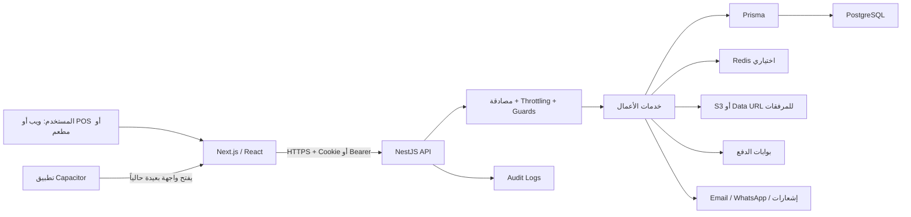

# تقرير المراجعة التقنية والهندسية والأمنية لمنصة Qootk / Hisaby

**تاريخ المراجعة:** 11 أغسطس 2026  
**المشروع:** `C:\dev\qootk-pro-complete`  
**الفرع والنسخة المحلية:** `main` عند الالتزام `a4f4cef`  
**نوع المراجعة:** تحليل ساكن للشيفرة، مراجعة معمارية وهندسية، تشغيل الاختبارات المحلية، فحص الاعتماديات، فحص آمن للواجهة والخدمات المنشورة، ومراجعة UI/UX وإمكانية الوصول.

> هذه مراجعة عميقة مبنية على الشيفرة والأدلة المتاحة، وليست بديلاً عن اختبار اختراق خارجي كامل ببيانات اعتماد متعددة الأدوار، ولا عن تدقيق البنية السحابية وقاعدة الإنتاج والنسخ الاحتياطية. لم تُنفّذ محاولات استغلال مؤذية، ولم تُعدّل ملفات المشروع.

## 1. الخلاصة التنفيذية

المنصة **غنية وظيفياً ومبنية على أساس حديث ومعقول**: فصل بين الواجهة والخلفية، نموذج بيانات واسع، عزل شركة مطبق في أجزاء كثيرة، مصادقة متعددة العوامل، تشفير جيد لأسرار بوابات الدفع، سجلات تدقيق، ووجود CI وترحيلات قاعدة بيانات. المنتج أقرب إلى **ERP/Accounting SaaS متقدم في مرحلة Beta** من كونه نموذجاً أولياً.

لكن الحكم الصريح هو: **النظام غير جاهز بعد ليُوصَف بأنه منصة مالية عالمية عالية الصلابة**. السبب ليس ضعف الفكرة أو قلة الخصائص، بل وجود مجموعة صغيرة من المخاطر ذات الأثر الكبير في التفويض، تسرب الأسرار إلى سجل التدقيق، XSS في الطباعة، سباقات معالجة الدفع والترقيم، الإفراط في البيانات العامة، وSSRF محتمل في إعداد بوابة Thawani. كما أن النسخة المنشورة متأخرة 32 التزاماً عن الشيفرة المحلية، وتعمل من دون Redis وSentry وS3 والبريد الإلكتروني وفق فحص الصحة المنشور.

**التقدير الإجمالي الحالي: 5.1/10.**  
المنتج قوي كمنصة تجريبية متقدمة، لكنه يحتاج إغلاق عناصر P0/P1 واختبار اختراق مستقل قبل فتح التسجيل العام أو التوسع الدولي.

| المجال | التقدير | الملاحظة المختصرة |
|---|---:|---|
| اتساع المنتج والوظائف | 8.0/10 | وحدات محاسبة ومبيعات ومخزون وPOS ومطاعم وفوترة واشتراكات واسعة |
| التصميم والهوية وتجربة الواجهة | 7.3/10 | هوية متماسكة واستجابة جيدة، مع مشكلات ثقة وإتاحة ووضوح التسويق |
| المعمارية وقابلية الصيانة | 5.5/10 | أساس جيد، لكن خدمات ضخمة واعتماد كبير على الانضباط اليدوي لعزل المستأجر |
| أمن التطبيق في الشيفرة الحالية | 5.2/10 | ضوابط مهمة موجودة، لكن عدة نتائج عالية الأثر يجب إغلاقها فوراً |
| موثوقية الدفع والبيانات المالية | 4.8/10 | معاملات موجودة، لكن توجد سباقات وترقيم وعمليات مالية مبنية على `Number` |
| الاختبارات والثقة في الإصدار | 3.5/10 | 31 اختبار Backend فقط، لا اختبارات Frontend فعلية، وتعارض في `node_modules` |
| التشغيل والمراقبة والتعافي | 3.5/10 | الإنتاج متأخر، ومكونات الصلابة الأساسية غير مفعلة أو غير مثبتة |
| الجاهزية العالمية | 3.0/10 | النظام مرتبط بعُمان وOMR، ولا توجد بعد بنية Country Packs أو امتثال عالمي |

## 2. نطاق المراجعة ومنهجها

شملت المراجعة:

- جرد 785 ملفاً متتبّعاً، منها نحو 541 ملف مصدر وما يقارب 113,406 أسطر شيفرة.
- Backend يضم قرابة 294 ملفاً و46,473 سطراً، وFrontend نحو 230 ملفاً و66,124 سطراً.
- مراجعة 73 نموذج Prisma و66 ترحيلاً و48 Controller تقريباً.
- تتبع المصادقة والجلسات والصلاحيات وعزل الشركات وبوابات الدفع والوثائق العامة والمرفقات وسجلات التدقيق.
- البحث في الشيفرة الحالية وتاريخ Git عن مفاتيح أو أسرار ظاهرة؛ لم يظهر سر إنتاج حقيقي عالي الثقة.
- تشغيل اختبارات Backend وفحوص TypeScript، وفحص إعداد اختبارات Frontend.
- فحص `npm audit --omit=dev` مقابل ملفات القفل بتاريخ التقرير.
- فتح النسخة المنشورة ومراجعة الصفحة الرئيسية وتسجيل الدخول والتسجيل على سطح المكتب والهاتف، وقراءة رؤوس الأمان ونقاط الصحة العامة بطريقة غير تخريبية.

لم تشمل المراجعة:

- الوصول إلى قاعدة بيانات الإنتاج أو إعدادات Vercel/Render/Neon أو الأسرار الفعلية.
- اختبار اختراق نشط، fuzzing واسع، أو تجربة فصل الشركات بحسابات حقيقية متعددة.
- مراجعة PCI رسمية، أو تدقيق قانوني لـ GDPR/PDPL، أو تدقيق ISO 27001/SOC 2.
- اختبار تحميل أو فوضى أو استعادة فعلية من نسخة احتياطية.

## 3. كيف يعمل النظام

### المكونات الرئيسة

- **Frontend:** Next.js 15 حسب `package.json` وملف القفل، React، Tailwind، ودعم العربية/الإنجليزية.
- **Backend:** NestJS 11 حسب ملفات المشروع، Prisma، PostgreSQL، JWT وRefresh Tokens، TOTP، وجدولة مهام.
- **التخزين المؤقت والحماية من الإسراف:** Redis اختياري؛ عند غيابه يستخدم النظام ذاكرة العملية.
- **المرفقات:** S3 اختياري، مع مسار بديل يخزن Data URLs.
- **المدفوعات:** بوابات على مستوى المنصة وعلى مستوى الشركة، مع تشفير حقول الأسرار.
- **الموبايل:** غلاف Capacitor يفتح واجهة ويب بعيدة، وليس تطبيقاً مستقلاً كاملاً حالياً.

تدفق المصادقة الأساسي جيد من حيث المبدأ: تسجيل دخول، Access Token قصير، Refresh Token أطول مخزن كـ hash، تدوير للتوكن عند التجديد، Cookie آمنة في الإنتاج، وفحص استمرار نشاط المستخدم والشركة. المشكلة الرئيسة ليست غياب المصادقة، بل أن **التفويض الدقيق للوحدات لا يُفرض مركزياً على جميع المسارات**.

## 4. نقاط القوة

### 4.1 أمنية وتشفيرية

- تشغيل الإنتاج يفشل إذا كانت أسرار JWT أو مفتاح أسرار الدفع ضعيفة أو مفقودة، ويشترط اختلاف سر الوصول عن سر التجديد: `backend/src/common/crypto/secrets.crypto.ts:71`.
- تشفير أسرار البوابات يستخدم **AES-256-GCM** مع IV عشوائي 12 بايت وAuthentication Tag، وهو اختيار تشفيري صحيح: `backend/src/common/crypto/secrets.crypto.ts:5`.
- Refresh Tokens وAPI Keys محفوظة كـ SHA-256 hash بدلاً من النص الصريح.
- كلمات المرور تستخدم bcrypt بكلفة 12، مع قفل بعد محاولات فاشلة، ودعم TOTP.
- Cookies مضبوطة `HttpOnly` و`Secure` في الإنتاج، مع مدد معقولة: Access 15 دقيقة وRefresh 7 أيام.
- Helmet، والتحقق الصارم من DTOs عبر `whitelist` و`forbidNonWhitelisted`، وقائمة CORS محددة.
- Swagger معطل في الإنتاج، والحاوية تعمل بمستخدم غير root.
- لم يظهر من البحث في الشيفرة الحالية أو تاريخ Git مفتاح خاص أو Secret إنتاج حقيقي عالي الثقة. ملف `.env.production` المتتبع يضم قيماً عامة فقط، لكن الأفضل مع ذلك عدم تتبع أي ملف باسم إنتاج مستقبلاً.

### 4.2 هندسية ووظيفية

- نموذج بيانات واسع وعلاقات وفهارس وقيود مركبة كثيرة.
- استخدام معاملات قاعدة البيانات في عدد من العمليات المالية والحساسة.
- تغطية وحدات أعمال كبيرة: المحاسبة، المبيعات، المشتريات، المخزون، الأصول، POS، المطاعم، الرواتب، التقارير، الاشتراكات والدفع.
- وجود Migration history حقيقي، وCI، وDependabot، ووثائق تشغيل كثيرة.
- استعمال escaping جيد في مولد HTML العام للفواتير `public-document-html.ts`، بخلاف مسارات الطباعة في الواجهة التي تحتاج إصلاحاً.

### 4.3 تصميم وتجربة استخدام

- هوية بصرية خضراء متناسقة ومناسبة للسوق العُماني، واتجاه RTL جيد.
- الصفحة الرئيسية تتجاوب مع عرض 390px من دون تمرير أفقي.
- تقسيم المنتج ورسائل الدعوة إلى الإجراء واضحة عموماً.
- استخدام جيد للعناوين والروابط الأساسية، وزر Google يملك اسماً متاحاً لقارئات الشاشة.

## 5. النتائج الأمنية ذات الأولوية

### SEC-01 — تسرب أسرار متداخلة إلى سجل التدقيق

**الخطورة: عالية — P0 — ثقة عالية**

`AuditInterceptor.safeBody()` يحجب الحقول الحساسة في المستوى الأول فقط. لكنه لا ينزل داخل الكائنات المتداخلة: `backend/src/audit/audit.interceptor.ts:98`. وفي الوقت نفسه تقبل نقاط إعداد بوابات الدفع كائناً متداخلاً باسم `configJson` يحوي `secretKey` و`webhookSecret`: `backend/src/payments/dto/payment.dto.ts:4`. النتيجة المحتملة أن أسرار البوابة تُشفّر في جدول إعدادات الدفع، لكنها تُحفظ قبل التشفير كنص صريح داخل `audit_logs`.

هذا النمط قد يمس أيضاً PIN/OTP/token في أجسام متداخلة أخرى. وبهذا يصبح سجل التدقيق مخزناً سرياً غير مقصود.

**المعالجة:**

1. إيقاف تسجيل body كلياً لمسارات الأسرار والمصادقة والدفع، واعتماد قائمة سماح للحقول الآمنة بدلاً من blacklist.
2. تطبيق redaction عميق وآمن على الكائنات والمصفوفات مع حد عمق وحجم ومنع prototype keys.
3. فحص `audit_logs` تاريخياً بحثاً عن حقول حساسة، ثم حذف/تنقيح السجلات المتأثرة وفق سياسة قانونية موثقة.
4. تدوير مفاتيح بوابات الدفع وWebhook وأي PIN/token يظهر في السجل.
5. إضافة اختبارات تثبت عدم ظهور الأسرار في أي مستوى متداخل.

### SEC-02 — صلاحيات الوحدات غير مفروضة بصورة شاملة

**الخطورة: عالية — P0 — ثقة عالية**

يوجد `ModulePermissionGuard` جيد المبدأ ويربط المسارات بوحدات مثل المبيعات والمحاسبة والتقارير: `backend/src/common/guards/module-permission.guard.ts:20`. لكنه غير مسجل كـ `APP_GUARD` في `backend/src/app.module.ts:113`، ولا تستخدمه إلا Controllers محدودة. Controllers حساسة مثل الفواتير والحسابات تعتمد على JWT فقط، أو على Role عام.

هذا يعني أن إخفاء وحدة من الواجهة أو منعها في إعدادات المستخدم **لا يضمن منع استدعاء API مباشرة**. المستخدم المصدق ذو الدور المناسب قد يصل إلى وحدة غير ممنوحة له.

**المعالجة:**

- تصميم تفويض مركزي fail-closed. إما Guard عالمي مع `@Public()` وMetadata واضحة، أو إلزام كل Controller خاص بـ `@RequireModuleAccess` مع فشل إذا لم يكن المسار مصنفاً.
- فصل الأفعال إلى `read/create/update/delete/approve/export` بدلاً من صلاحية وحدة ثنائية.
- إضافة مصفوفة اختبارات تكامل لكل Role × Module × Action، واختبارات سلبية لعزل الشركات.
- عدم اعتبار حماية الواجهة حماية أمنية.

### SEC-03 — Stored DOM XSS في مسارات الطباعة

**الخطورة: عالية — P0 — ثقة عالية**

`frontend/src/lib/invoice-print.ts` يبني HTML نصياً ويدخل وصف الصنف واسم العميل والملاحظات قبل تمريره إلى `document.write()` في نافذة من نفس الأصل. دالة `escapeAttr()` لا تهرب النصوص، بل تستبدل علامات الاقتباس فقط: الأسطر `123` و`167` و`265` و`291` و`375`. يوجد النمط نفسه في طباعة المطبخ وتقارير المطعم وورديات POS.

مدخل مثل `` في وصف أو ملاحظة قد ينفذ JavaScript عندما يطبع موظف مصدق المستند. سياسة CSP الحالية لا تحدد `script-src`، فلا توفر طبقة كبح قوية.

**المعالجة:**

- إزالة تركيب HTML النصي من بيانات المستخدم. استخدام React أو `textContent` وDOM APIs.
- عند الحاجة إلى template نصي، استخدام escape صحيح للنص والخصائص لكل قيمة بلا استثناء.
- عرض الطباعة داخل iframe sandboxed أو صفحة طباعة مع CSP صارمة وnonce، ومنع inline scripts.
- إضافة اختبارات payloads تشمل HTML وSVG و`onerror` وURLs خطرة.

### SEC-04 — سباق في اعتماد الدفع وإمكانية التكرار

**الخطورة: عالية — P0 — ثقة عالية**

الدالة في `backend/src/payments/payments.service.ts:587` تسمي قراءة السجل “locked”، لكنها تستخدم `findUnique` عادياً بلا row lock أو claim ذري. يمكن لـ Webhook وصفحة العودة الوصول معاً، ويرى كلاهما الحالة `PENDING`، ثم ينشئ كلاهما Payment ويحدث الفاتورة. كما أن `Payment.reference` ليس فريداً في `prisma/schema.prisma:857`.

**المعالجة:**

- claim ذري بـ `updateMany({ where: { id, status: 'PENDING' }, data: { status: 'PROCESSING' } })`، ولا يكمل إلا من غيّر صفاً واحداً.
- أو معاملة `SERIALIZABLE`/`SELECT ... FOR UPDATE` مع retry محسوب.
- قيد فريد على `(gateway, externalPaymentId)` أو مفتاح idempotency مستقل.
- جدول Webhook Events يحفظ event id/hash وحالة المعالجة.
- اختبار تزامن يرسل return وwebhook عدة مرات ويثبت إنشاء قيد مالي واحد فقط.

### SEC-05 — البيانات العامة للفواتير أوسع من اللازم

**الخطورة: عالية — P0 — ثقة عالية**

`backend/src/invoices/document-share.service.ts:219` يجلب `contact: true` والفاتورة كاملة، ثم يعيدها في JSON عام عبر `public-documents.controller.ts:32`. نموذج Contact يحوي رقم الضريبة والسجل والهواتف والعنوان والأرصدة والحد الائتماني ونقاط الولاء والملاحظات والحقول الخاصة. والفاتورة قد تحوي XML موقّعاً وhashes وحقولاً داخلية.

رمز المشاركة المكون من 10 أحرف يبدو عشوائياً وذا entropy جيد، لكن **امتلاك الرابط لا يبرر كشف كل هذه الحقول**.

**المعالجة:**

- إنشاء `PublicInvoiceDto` صريح واختيار الحقول بـ Prisma `select`، لا إعادة نموذج قاعدة البيانات.
- الاكتفاء بالاسم التجاري، رقم المستند، البنود، الإجماليات، العملة، والحقول القانونية المطلوبة.
- منع الأرصدة والملاحظات وXML والـ IDs الداخلية وcustom fields من المخرج العام.
- إضافة انتهاء صلاحية وإبطال وتدوير للروابط، وتخزين hash للرمز إن أمكن.

### SEC-06 — SSRF من عنوان Thawani القابل للضبط

**الخطورة: عالية — P0 — ثقة عالية**

تسمح إعدادات الشركة وPlatform Admin بتمرير `configJson` عاماً، ويتضمن Metadata حقل `baseUrl`: `backend/src/payments/gateway.constants.ts:22`. ثم ينفذ Adapter طلب `fetch()` مباشراً إلى هذا العنوان في `backend/src/payments/adapters/thawani.adapter.ts:52-58` و`102-105`.

يمكن لمسؤول شركة خبيث أو حساب مسؤول مخترق توجيه الخادم إلى عنوان داخلي أو metadata service، مع إرسال مفتاح Thawani في header. هذا SSRF وقد يصبح تسريباً للأسرار أو نقطة استكشاف للشبكة الداخلية.

**المعالجة:**

- عدم السماح للشركات بتعديل base URL أساساً؛ اختيار عنوان UAT/Production من enum داخلي.
- allowlist دقيقة لـ `uatcheckout.thawani.om` و`checkout.thawani.om` مع HTTPS فقط.
- حل DNS والتحقق من منع private/link-local/loopback IPv4 وIPv6، وإعادة التحقق بعد redirects ومنع DNS rebinding.
- تعطيل redirects أو تقييدها، ووضع مهلة وحجم استجابة أقصى.
- التحقق من مفاتيح `configJson` ورفض أي مفتاح غير معروف.

### SEC-07 — دورة حياة كلمة المرور غير مكتملة

**الخطورة: عالية — P1 — ثقة عالية**

لا توجد رحلة مكتملة للمستخدم لتغيير كلمة المرور أو “نسيت كلمة المرور”. إعادة الضبط الإدارية في `backend/src/admin/admin.service.ts:1097` تنشئ كلمة مؤقتة لكنها لا تلغي الجلسات ولا تفرض التغيير، وقد تعيد النص الصريح للمسؤول إذا تعذر البريد.

**المعالجة:** رابط Reset أحادي الاستخدام، token مخزن كـ hash بمدة 10–15 دقيقة، إلغاء كل الجلسات عند التغيير، `mustChangePassword`، إشعار المستخدم، recovery codes، وعدم إعادة كلمة سر صريحة في API مطلقاً.

### SEC-08 — CSRF مشروط عند استخدام SameSite=None

**الخطورة: متوسطة إلى عالية حسب النشر — P1**

يسمح إعداد Cookie بـ `SameSite=None` عندما تكون الواجهة والـ API على مواقع مختلفة، ولم يظهر CSRF token أو تحقق Origin/Referer مركزي. CORS وحده لا يمنع form CSRF، وBackend يقبل `urlencoded` bodies. الإعداد الحالي الظاهر يستخدم `Lax`، لذلك الخطر مشروط بتغيير النشر.

**المعالجة:** عند استخدام cookie عبر المواقع، إضافة double-submit token أو synchronizer token، والتحقق من Origin/Referer لكل mutation. يمكن إعفاء Bearer/API-key requests التي لا تستخدم Cookie.

### SEC-09 — تجاوز قفل TOTP أثناء صلاحية الجلسة المؤقتة

**الخطورة: متوسطة — P1**

التحقق من TOTP يقرأ `lockedUntil` ضمن بيانات المستخدم لكنه لا يرفض الطلب بناء عليه قبل تجربة الرمز: `backend/src/auth/auth.service.ts:157`. بعد بلوغ حد المحاولات، قد تظل جلسة 2FA المؤقتة قادرة على إرسال محاولات إضافية.

**المعالجة:** فحص القفل أولاً، عدّاد مستقل لـ OTP مرتبط بالمستخدم والجلسة المؤقتة وIP، وإبطال temp token عند بلوغ الحد.

### SEC-10 — إدارة المفاتيح جيدة كبداية وليست عالمية

**الخطورة: متوسطة — P1**

AES-GCM صحيح، لكن المفتاح مشتق بـ SHA-256 من secret نصي واحد، ويُستخدم الغرض نفسه لأسرار البوابات وTOTP، ولا يوجد key id أو version أو AAD أو تدوير. المسار يعيد النص كما هو إذا غاب المفتاح، وإن كان production validation يمنع ذلك عادة.

**المعالجة:** KMS/HSM وEnvelope Encryption، مفاتيح منفصلة حسب الغرض، version/key id داخل ciphertext، AAD يتضمن `companyId + fieldName`، ودورة تدوير وإعادة تشفير. يجب ترحيل أي قيمة legacy غير مشفرة والتحقق منها.

### SEC-11 — API Keys واسعة الصلاحية

**الخطورة: متوسطة — P1**

أي API Key صالحة تتحول عملياً إلى مستخدم بدور ACCOUNTANT، بلا scopes دقيقة أو انتهاء أو allowlist للمسارات/IP. الحفظ كـ hash نقطة قوة، لكن blast radius كبير.

**المعالجة:** scopes لكل مفتاح، انتهاء إلزامي، تدوير، last-used/IP، endpoint allowlist، مفاتيح منفصلة للقراءة/الكتابة، ومراجعة دورية.

### SEC-12 — المرفقات لا تملك سلسلة فحص وخصوصية كافية

**الخطورة: متوسطة — P1**

الوضع الافتراضي `dataurl`، والنسخة المنشورة أفادت أن S3 غير مفعّل. يتم الاعتماد بدرجة كبيرة على MIME المعلن، ولا يظهر فحص magic bytes أو Antivirus/quarantine.

**المعالجة:** S3 خاص مع SSE-KMS، روابط موقعة قصيرة، فحص magic bytes، Antivirus/Object scanning، quarantine، حدود حجم ونوع صارمة، retention/lifecycle، ومنع التنفيذ وContent-Disposition attachment.

### SEC-13 — سجل التدقيق يمكن أن يفشل بصمت

**الخطورة: متوسطة — P1**

`AuditService.log()` يبتلع الأخطاء، والـ interceptor يطلق الكتابة دون انتظار. هذا يحمي الطلب التجاري من التعطل لكنه يسمح بفقد سجل امتثال بلا إنذار.

**المعالجة:** Transactional outbox أو queue دائمة، إنذار عند الفشل، correlation IDs، immutable/WORM storage للعمليات الحرجة، سياسة احتفاظ ووصول، وعدم حفظ body خام.

### SEC-14 — عدم اتساق تطبيع البريد وكلمة المرور

**الخطورة: متوسطة — P1**

Login يحول البريد إلى lowercase ويقص كلمة المرور، بينما Register يخزن المدخل بلا transforms. بريد بحروف كبيرة أو كلمة سر تبدأ/تنتهي بمسافة قد ينتج حساباً لا يمكن الدخول إليه، كما قد تظهر ازدواجية case حسب collation.

**المعالجة:** تطبيع البريد دائماً عند الحدود وفي قاعدة البيانات (`normalizedEmail` أو CITEXT مع unique)، وعدم قص كلمة المرور عند الدخول؛ تعامل معها كسلسلة opaque.

### SEC-15 — تنبيهات اعتماديات حالية

**الخطورة: عالية في أداة الفحص، والاستغلال الفعلي يحتاج تحقق reachability — P1**

أظهر `npm audit --omit=dev` بتاريخ 11 أغسطس 2026:

- Backend: تنبيهان High ينتقلان من `@nestjs/swagger` إلى `js-yaml 4.3.0`. الإصلاح في `4.3.1` وفق [GHSA-5p4m-2wfm-xmqj](https://github.com/advisories/GHSA-5p4m-2wfm-xmqj). Swagger معطل في الإنتاج ولا يظهر parsing لـ YAML غير موثوق، لذلك قابلية الاستغلال الحالية تبدو منخفضة، لكن التحديث مطلوب.
- Frontend: 13 تنبيهاً إنتاجياً (11 High و2 Moderate) تنتشر عبر سلاسل `nanoid/postcss` و`DOMPurify/jspdf`. راجع [GHSA-2v37-7h3g-55p8](https://github.com/advisories/GHSA-2v37-7h3g-55p8) و[GHSA-55q2-fjhq-7xh7](https://github.com/advisories/GHSA-55q2-fjhq-7xh7). لم يظهر استدعاء مباشر لـ DOMPurify، وتنبيه nanoid مشروط باستدعاء مولد مخصص بحجم صفر، فلا ينبغي اعتبار كل سلسلة قابلة للاستغلال تلقائياً.

**المعالجة:** تحديث/override للنسخ المصححة، إعادة `npm ci` واختبارات البناء، توثيق reachability والاستثناء المؤقت بتوقيع وموعد انتهاء، وإضافة SBOM وOSV/SCA إلى CI.

## 6. قضايا هندسية ومالية

### 6.1 مولدات الأرقام غير آمنة مع التزامن

توليد رقم الفاتورة والطلب ووثائق أخرى يقرأ آخر رقم نصي ثم يزيده، مثل `backend/src/invoices/invoices.service.ts:57` و`backend/src/resto/resto.service.ts:1622`. طلبان متزامنان قد يختاران الرقم نفسه. كما أن الفرز النصي يجعل `9999` أعلى من `10000`، وقد يؤدي إلى توقف/تكرار عند تجاوز أربعة أرقام.

**الحل:** Counter table لكل `(company, documentType, year/branch)` وتحديث ذري `UPDATE ... RETURNING`، أو DB sequence مناسبة، مع unique constraint وretry وIdempotency key. يجب تصميم الترقيم حسب قانون كل دولة ومنع الحذف أو إعادة الاستخدام بعد الاعتماد.

### 6.2 الحسابات المالية تعتمد على JavaScript Number

يظهر `Number` و`toFixed(3)` في حساب الفواتير والدفع، مثل `invoices.service.ts:48` و`payments.service.ts:630`. Floating point قد ينتج فروقاً تراكمية أو اختلافاً في التقريب بين دفتر الأستاذ والفاتورة والبوابة.

**الحل:** `Prisma.Decimal/decimal.js` من الإدخال حتى قاعدة البيانات، أو minor units كأعداد صحيحة عند الحدود. إضافة metadata للعملة (0/2/3 decimals) وسياسة tax rounding واختبارات property-based للخصم والضريبة والاسترداد.

### 6.3 عزل الشركات يعتمد على انضباط كل Service

`PrismaService` عميل Prisma عام بلا tenant middleware أو PostgreSQL RLS. توجد شروط `companyId` في أماكن كثيرة، وهذا جيد، لكن نسيان شرط واحد يكفي لتسريب بين الشركات.

**الحل:** طبقة Repository مرتبطة بـ TenantContext، ويفضل RLS في PostgreSQL للبيانات الحساسة، مع composite foreign keys حيث يمكن، واختبارات Cross-tenant سلبية تلقائية لكل endpoint.

### 6.4 خدمات ضخمة جداً

`resto.service.ts` يتجاوز سبعة آلاف سطر تقريباً، و`pos.service.ts` أكثر من أربعة آلاف، وعميل API في الواجهة ضخم. هذا يرفع احتمال الانحدار ويصعب اختبار الصلاحيات والمعاملات.

**الحل:** Modular Monolith أولاً، لا Microservices مباشرة. تقسيم إلى bounded contexts واستخدام حالات استعمال صغيرة: Identity/Tenant، Accounting Ledger، Billing/Payments، Inventory، Sales/POS، Restaurant، Notifications. توليد عميل API من OpenAPI بدلاً من ملف يدوي واحد.

### 6.5 المهام المجدولة قد تتكرر عند التوسع الأفقي

`ScheduleModule.forRoot()` يعمل داخل تطبيق الويب. عند تشغيل عدة نسخ، قد تنفذ Cron jobs أكثر من مرة إن لم تملك distributed lock.

**الحل:** BullMQ/Queue على Redis، Worker منفصل، leader election أو lock موزع، ومفاتيح idempotency لكل Job.

### 6.6 الهجرات والنشر

Docker يشغّل `npx prisma migrate deploy` مع بدء كل نسخة من التطبيق. في التوسع قد تتسابق النسخ، ويرتبط توفر التطبيق بنجاح migration. توجد ترحيلات حذف أعمدة/جداول، لذلك يلزم نسخ احتياطي واختبار استعادة وخطة expand-contract.

**الحل:** Release job واحدة للهجرة، migrations متوافقة خلفياً، backfill منفصل، feature flags، والتحقق من النسخة قبل تحويل الترافيك.

### 6.7 الموبايل غلاف لموقع بعيد

إعداد Capacitor يشير افتراضياً إلى `https://bhd-pro.vercel.app/pos`، وهو اسم/نطاق قديم ومختلف عن Hisaby. التطبيق يحمّل الشيفرة البعيدة مباشرة، فيفقد قابلية العمل دون اتصال وإعادة إنتاج الإصدار، ويجعل اختراق الموقع مؤثراً فوراً على التطبيق.

**الحل:** PWA/حزمة محلية فعلية لـ POS مع offline-first وقاعدة محلية ومزامنة conflict-safe، إصدار موبايل مضبوط، MDM/device sessions، نطاق وهوية موحدان، واختبار سياسات المتاجر.

## 7. الاختبارات وجودة الإصدار

### النتائج المنفذة

- Backend Jest: **7 suites و31 اختباراً، كلها ناجحة**.
- Backend TypeScript: ناجح عند تعطيل incremental write.
- Frontend TypeScript: ناجح.
- Frontend Jest: **لا توجد اختبارات** ويخرج بنجاح لأن `passWithNoTests: true`، مع تحذير collision ناتج عن `.next/standalone/package.json`.
- CI يشغّل Typecheck للواجهة واختبار Playwright واحداً لتسجيل الدخول، ولا يشغّل Frontend unit tests أو lint كـ quality gate.

### مشكلة مهمة: البيئة المحلية غير متطابقة مع ملفات القفل

`node_modules` المثبتة قديمة:

- Backend مثبت عليه Nest 10 وSwagger 7، بينما `package.json/package-lock` يطلبان Nest 11 وSwagger 11.
- Frontend مثبت عليه Next 14 وnext-intl 3 وjsPDF 2، بينما ملفات المشروع تطلب Next 15 وnext-intl 4 وjsPDF 4.

لذلك نجاح الاختبارات المحلية مفيد للشيفرة، لكنه **لا يثبت نجاح النسخ المقصودة في lockfile**. المرجع يجب أن يكون Clean CI بـ `npm ci`، مع build وتشغيل integration tests في صورة مطابقة للإنتاج.

### الحد الأدنى المطلوب قبل التوسع

- Unit tests للخدمات المالية والتفويض والحسابات.
- Integration tests بقاعدة PostgreSQL حقيقية لكل migration وtransaction.
- E2E لمصفوفة الصلاحيات وعزل الشركات والدفع والاسترداد والإقفال المحاسبي.
- اختبارات تزامن للترقيم والويبهوك.
- Frontend component tests، واختبارات Accessibility بـ axe.
- Coverage gate تدريجي: 50% أولاً ثم 70% للمجالات الحساسة، مع تغطية 90% لمسارات الدفع والمصادقة والقيود المحاسبية.
- SAST وsecret scanning وSCA وSBOM وcontainer scan وDAST آمن على staging.

## 8. تقييم التشغيل الفعلي

في 11 أغسطس 2026:

- الصفحة `https://www.hisaby.pro` أعادت 200، بزمن تقريبي 567ms في عينة واحدة.
- API health وreadiness أعادا 200 بزمن يقارب 0.7–0.9 ثانية.
- رؤوس جيدة موجودة: HSTS و`X-Frame-Options: DENY` و`nosniff` وReferrer/Permissions policies.
- CSP الحالية جزئية: تضبط `frame-ancestors/base-uri/form-action/object-src` لكنها لا تضبط `default-src/script-src/connect-src/img-src/style-src`.
- Health المنشور أظهر أن Redis غير مضبوط، والتحديد يعمل في الذاكرة، وS3 غير مفعل والمرفقات Data URL، وSentry غير مفعل، والبريد غير مفعل.
- الإصدار المنشور يحمل الالتزام `0384917`، وهو سلف للنسخة المحلية ومتأخر عنها **32 التزاماً**.

هذا التأخر هو خطر تشغيلي من الدرجة الأولى: لا يمكن اعتبار إصلاح موجود في `main` حماية فعلية ما لم يصل إلى الإنتاج. كما أن memory throttling لا يتشارك الحالة بين النسخ ويُصفّر عند إعادة التشغيل، وغياب Sentry يقلل القدرة على اكتشاف الانحدار والهجمات، وتخزين المرفقات في قاعدة البيانات يرفع الحجم وكلفة النسخ والاستعادة.

راجع أيضاً وثائق المشروع نفسها:

- `docs/HISABY-RENDER-DEPLOY-STUCK-2026-08-10.md`
- `docs/HISABY-OPS-READINESS-AND-OPEN-ISSUES-2026-08-10.md`

**الإجراء الفوري:** تثبيت خط النشر، نشر commit معروف وموقّع، إظهار commit/version في لوحة الإدارة والمراقبة، ومنع تحويل الترافيك إذا لم تتطابق health مع الإصدار المتوقع.

## 9. التصميم، الثقة، وإمكانية الوصول

الفحص البصري الفعلي للصفحة الرئيسية وصفحات الدخول والتسجيل يؤكد أن التصميم متماسك ومتجاوب. لكنه يحتاج تحسينات قبل تقديمه عالمياً:

1. تباين نص Hero والنص المساند ضعيف أحياناً فوق الخلفية الفاتحة والزجاجية.
2. قائمة سطح المكتب مزدحمة، ويُفضل تجميع الوحدات تحت Product/Solutions.
3. حقول Login/Register لا تملك accessible names سليمة؛ توجد `label` بلا `htmlFor/id` في `frontend/src/app/login/page.tsx:226` وما بعدها.
4. لا يوجد رابط “نسيت كلمة المرور”.
5. لا تظهر في Footer صفحات Privacy وTerms وSecurity/Trust وSupport وStatus وContact.
6. التسجيل لا يعرض موافقة واضحة على الشروط والخصوصية.
7. قسم شعارات العملاء فارغ ويعرض نصاً تقنياً للمستخدم عن ظهور شعارات المشتركين تلقائياً؛ هذا يضعف الثقة.
8. نص الصفحة يقول إن وظائف المطاعم ستأتي “في الموجات التالية” رغم وجود KDS ووحدات مطاعم في المنتج؛ الرسالة قديمة.
9. أسماء الخطط “بدائية/محترفة/مؤسسية” تحتاج صياغة تسويقية أنسب مثل “أساسية/احترافية/مؤسسات”.
10. “ابدأ مجاناً” لا تتطابق بوضوح مع عرض أقل خطة مدفوعة؛ يجب توضيح مدة التجربة، الحاجة للبطاقة، الضرائب، الإلغاء والاسترداد.
11. لا توجد أدلة ثقة كافية: حالات استخدام، شهادات عملاء، صور منتج، صفحة أمان، حالة الخدمة، أو سياسات امتثال.

**هدف الواجهة:** WCAG 2.2 AA، دعم لوحة المفاتيح، focus states واضحة، skip link، تباين 4.5:1 للنص العادي، رسائل خطأ مرتبطة بالحقول، واختبارات axe وscreen-reader يدوية.

## 10. الخصوصية والامتثال

المنصة تعالج بيانات مالية وتجارية وشخصية، وتخزن تحليلات عامة تشمل IP وUser-Agent وreferrer وربما الموقع. لم يظهر ضمن تجربة الموقع إطار واضح للخصوصية أو الاحتفاظ أو حقوق أصحاب البيانات.

للتوسع العالمي يلزم:

- Privacy Policy وTerms وDPA وقائمة Subprocessors وصفحة Trust Center.
- سجل لأنواع البيانات وأغراضها والأساس القانوني وفترات الاحتفاظ.
- Data Subject Requests للتصدير والتصحيح والحذف والتقييد، مع استثناءات السجلات المالية القانونية.
- تقليل/pseudonymization لعناوين IP ومدة قصيرة لتحليلات الموقع.
- Data residency واختيار إقليم المستأجر، وعدم نقل البيانات بين الأقاليم بلا أساس.
- Incident response وbreach notification حسب GDPR والقوانين المحلية.
- إبقاء بيانات البطاقة خارج النظام عبر Hosted Checkout، واستهداف PCI DSS SAQ A، مع التحقق الرسمي.
- خارطة SOC 2 Type II أو ISO 27001 بعد استقرار العمليات، لا كبديل عن الأمن البرمجي.

## 11. خطة الإغلاق والتطوير

### المرحلة صفر — أول 48 ساعة إلى أسبوعين

**الهدف: منع خسارة سر/مال/بيانات وتوحيد الواقع مع الشيفرة.**

1. تجميد الخصائص الجديدة مؤقتاً، وإصلاح خط النشر ونشر النسخة المقصودة بعد CI نظيف.
2. إصلاح SEC-01، فحص Audit Logs، وحذف/تنقيح الأسرار وتدويرها.
3. إصلاح XSS في كل مسارات `document.write` والطباعة، ونشر CSP أقوى.
4. فرض ModulePermissionGuard بصورة مركزية مع اختبارات Roles.
5. جعل اعتماد الدفع idempotent وذرياً، وإضافة قيود فريدة واختبار التزامن.
6. تضييق Public Invoice DTO وإبطال/تدوير روابط المشاركة القديمة الحساسة.
7. إغلاق SSRF وحصر عناوين بوابات الدفع.
8. تشغيل Redis محمياً بـ TLS/ACL، وSentry، وPrivate S3، والبريد، وWAF/rate limiting على الحافة.
9. تثبيت الاعتماديات عبر `npm ci` في بيئة نظيفة ومعالجة advisories.
10. أخذ نسخة احتياطية مشفرة وتنفيذ Restore Drill فعلي قبل أي migration جديد.

**بوابة الخروج:** لا P0 مفتوحة، الإنتاج عند commit المدقق، payment exactly-once مثبت بالاختبار، ونسخة احتياطية استعيدت بنجاح.

### المرحلة الأولى — 3 إلى 6 أسابيع

1. Forgot/Change Password، Email verification، إلغاء الجلسات، Recovery codes، ويفضل Passkeys/WebAuthn للإدارة.
2. Tenant Repository/RLS واختبارات cross-tenant شاملة.
3. API-key scopes وانتهاء ودوران.
4. عدادات ذرية للترقيم وDecimal money في كل المجالات المالية.
5. Webhook ledger وTransactional outbox وQueue workers وdistributed locks.
6. CI إلزامي: lint بلا `--fix`، unit/integration/e2e، coverage، SAST، secret scan، SCA، SBOM، container scan.
7. Release job واحدة للهجرات ونشر Blue/Green أو Canary مع rollback.
8. تشديد CSP وCSRF ورفع سرية المرفقات وسجل التدقيق الدائم.

### المرحلة الثانية — شهران إلى أربعة أشهر

1. **Country Pack architecture:** قواعد ضريبية وترقيم وفواتير إلكترونية وتقويم وعطلات واحتفاظ لكل دولة.
2. **Currency engine:** minor units وrounding وFX rates مؤرخة وإقفال فروقات العملة.
3. **Localization:** ICU messages وCLDR وترجمة احترافية ومسارات locale وتواريخ/أرقام/عملات حسب المنطقة. توجد قيم OMR/Oman hard-coded في التسجيل ويجب إزالتها.
4. Adapters موثقة ومتحقق منها للفوترة الإلكترونية: عُمان أولاً، ثم ZATCA للسعودية ومتطلبات الإمارات، ثم أسواق مختارة بدلاً من محاولة دعم العالم دفعة واحدة.
5. Data residency وtenant region pinning ونسخ احتياطي PITR مشفر ومراقب.
6. Trust Center وStatus Page وSecurity Contact وDPA/Subprocessors وسياسات الخصوصية.
7. توثيق API وإصدارات `/v1` وSDKs/Webhooks موثوقة وشركاء تكامل.
8. PWA/Offline POS حقيقي واختبارات انقطاع الشبكة والمزامنة.

### المرحلة الثالثة — 4 إلى 9 أشهر

1. إنهاء Modular Monolith بحدود واضحة؛ استخراج خدمة مستقلة فقط عند وجود حاجة قياس/امتثال مثبتة.
2. بنية Active-Passive متعددة المناطق أولاً، ثم Active-Active فقط إذا بررت البيانات والتكلفة التعقيد.
3. SLOs وError Budgets: توفر 99.9% كبداية، RPO ≤ 15 دقيقة، RTO ≤ 60 دقيقة، ومراقبة p95/p99.
4. اختبار اختراق خارجي قبل التسجيل العام ثم سنوي وبعد تغييرات الدفع/الهوية.
5. Threat modeling ربع سنوي، تمارين Incident/DR، وBug bounty بعد نضج الاستجابة.
6. شهادات SOC 2/ISO 27001 بعد اكتمال الضوابط التشغيلية والأدلة.

## 12. معايير اعتبار النظام “عالمياً وصلباً”

لا أوصي بإطلاق وصف “عالمي” قبل تحقيق الحد الأدنى الآتي:

- صفر ثغرات Critical/High قابلة للوصول، وأي استثناء موثق بمالك وتاريخ انتهاء وتعويضات.
- اختبار مستقل يؤكد منع Cross-tenant access وIDOR.
- كل مسار مالي يملك idempotency، قيوداً قاعدة-بيانية، وتطابقاً بين Subledger وGeneral Ledger.
- استعادة ناجحة ومقاسة من نسخة احتياطية، مع RPO/RTO معلنين.
- إنتاج قابل لإعادة البناء من lockfiles وSBOM، ويعرض commit المدقق نفسه.
- Redis/Queue/Observability/Object storage والبريد تعمل بتهيئة إنتاجية، لا fallbacks صامتة.
- WCAG 2.2 AA، ودعم لغوي/مالي/ضريبي مختبر لكل Country Pack.
- Privacy/Terms/DPA/Retention/DSR/Incident plan منشورة ومفعلة.
- SLO ومراقبة وأمن حافة واختبار تحميل يستندان إلى أرقام حقيقية.
- لا hard-coding لدولة أو عملة داخل منطق التسجيل أو الدفتر.

## 13. ترتيب الأولويات المقترح للإدارة

| الترتيب | العمل | سبب الأولوية |
|---:|---|---|
| 1 | إصلاح النشر وإظهار commit الحقيقي | كل إصلاح آخر بلا قيمة إن لم يصل إلى الإنتاج |
| 2 | Audit secret leak + تدوير الأسرار | احتمال كشف مفاتيح مالية داخل النظام نفسه |
| 3 | التفويض المركزي وعزل الشركات | يمنع وصول مستخدم مصدق إلى بيانات/وحدات غير مصرح بها |
| 4 | Idempotency الدفع والترقيم | يمنع ازدواج المال والمستندات وفشل التزامن |
| 5 | XSS والطباعة وCSP | يمنع تنفيذ شيفرة في جلسة موظف مصدق |
| 6 | Public DTO + SSRF | يقلل كشف PII ويمنع استخدام الخادم كوكيل داخلي |
| 7 | Backup/Restore + Redis/Sentry/S3 | يحول المنتج من Beta إلى خدمة قابلة للتشغيل |
| 8 | الاختبارات وClean CI | يمنع عودة المشكلات ويجعل الإصدار قابلاً للإثبات |
| 9 | Decimal/RLS/Modularization | صلابة مالية وهندسية طويلة الأجل |
| 10 | Country Packs والامتثال | أساس التوسع المنضبط دولة بعد دولة |

## 14. الحكم النهائي

المشروع **ليس ضعيفاً**؛ بالعكس، لديه اتساع وظيفي وأساس أمني أفضل من كثير من المنتجات في مرحلته. نقاط قوته الحقيقية هي النموذج التجاري الواسع، التقنيات الحديثة، بعض الضوابط الأمنية الصحيحة، والهوية المناسبة للسوق الأول.

لكن الصلابة لا تُقاس بعدد الوحدات. في نظام مالي متعدد الشركات، الصلابة تُقاس بـ: تفويض مركزي لا يمكن تجاوزه، عزل tenant مدعوم من قاعدة البيانات، معالجة مالية exactly-once، حساب Decimal، نشر قابل للإثبات، نسخ احتياطية مستعادة، ومراقبة تعمل فعلياً. هذه الجوانب هي الفجوة الحالية.

**التوصية الإدارية:** اعتبر النسخة الحالية Beta مغلقة أو Pilot مدارة. أغلق المرحلة صفر كاملة، ثم نفذ اختبار اختراق مستقل وRestore Drill واختبار تحميل. بعد ذلك يمكن فتحها تدريجياً للسوق العُماني، ثم توسيعها عبر Country Packs إلى سوق أو سوقين في كل موجة، بدلاً من إعلان دعم عالمي عام غير قابل للإثبات.

---

### ملاحظة عن سلامة المراجعة

لم يتم تغيير أي ملف داخل `C:\dev\qootk-pro-complete`. نتائج الاختبارات المحلية يجب إعادة تأكيدها في Clone نظيف أو CI لأن `node_modules` الحالية لا تطابق ملفات القفل.
