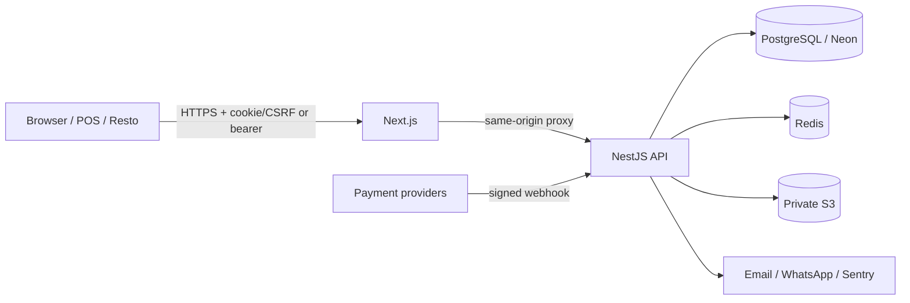

# Threat model — Hisaby / حسابي

## النطاق والأصول

الأصول الأعلى حساسية: بيانات الشركات المالية، حسابات المستخدمين والجلسات، مفاتيح API، أسرار الدفع وTOTP، webhooks، المرفقات، سجلات التدقيق، أرقام المستندات، وبيانات العملاء الظاهرة عبر الروابط العامة.

## حدود الثقة

يُعامل كل مدخل من المتصفح، مفاتيح API، webhook، روابط المشاركة، وmetadata الخارجية كمدخل غير موثوق. `companyId` الموثوق يأتي من هوية المصادقة لا من جسم الطلب أو عنوان يرسله العميل.

## أهم التهديدات والضوابط

| التهديد | الأثر | الضوابط الحالية | تحقق مطلوب |
|---|---|---|---|
| كسر عزل الشركات | كشف/تعديل مالي بين مستأجرين | companyId من الهوية، رفض X-Company-ID المتعارض، استعلامات tenant-bound | اختبارات حسابين بكل API حساس |
| تجاوز دور/وحدة | تعديل غير مصرح | حارس JWT مركزي + ModulePermission + Viewer read-only + API scopes | اختبار view/edit/hidden |
| سر في audit/error | استيلاء حساب/بوابة | sanitizer متداخل محدود الحجم + منع حقول الاعتماد | canary secrets وفحص logs |
| XSS في الطباعة | سرقة جلسة/تعديل إيصال | escaping مركزي، URL allowlist، CSP، إزالة document.write script | payloads في كل حقل مطبوع |
| SSRF عبر بوابة | metadata/cloud pivot | مفاتيح config allowlist، origins ثابتة، HTTPS، timeout، no redirect | عنوان loopback/metadata/redirect |
| webhook replay/race | دفعة مزدوجة | تحقق التوقيع والبوابة/session، atomic claim، unique idempotency | إرسال متزامن مكرر |
| CSRF | تعديل بجلسة الضحية | Origin + double-submit token، SameSite، bearer exemption | cross-origin form/fetch |
| سرقة مفتاح مخزن | كشف دفع/TOTP | AES-GCM، HKDF purpose separation، AAD tenant، key version/ring | rotation + wrong-AAD tests |
| مرفق متنكر | malware/content sniffing | magic bytes، حد 2MB، Content-Disposition attachment، private S3/SSE | EICAR في بيئة معزولة + AV لاحقاً |
| خطأ تقريبي/ترقيم | دفاتر غير صحيحة | Decimal وrounding مركزي، atomic sequences | concurrent creation/property tests |

## مخاطر متبقية

- CSP ما زالت تسمح بـ`unsafe-inline` لتوافق Next؛ الانتقال إلى nonce/strict-dynamic يحتاج مساراً مستقلاً واختبارات Google OAuth.
- التحقق بالمرفقات ليس بديلاً عن antivirus/CDR للملفات المكتبية.
- Decimal طُبق على المسارات المالية الحرجة، لكن يلزم استكمال منع `Number()` للحسابات في الخدمات القديمة.
- لا يوجد دليل شهادة امتثال أو pentest إنتاجي مستقل ضمن هذه الحزمة.
- روابط المستندات طويلة العمر تتطلب سياسة إبطال/تدوير short codes كمرحلة لاحقة.

راجع النموذج كل ربع سنة، وبعد إضافة دولة، بوابة دفع، تكامل خارجي، أو تغيير جوهري في الهوية.
